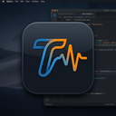

<div align="center">
  
  <h1>Tilt</h1>
  <p><strong>A privacy-first Developer Operating System for Self-Awareness.</strong></p>
  
  <p>
    
    
    
    
  </p>
</div>

<hr />

> **🎉 Version 0.1.0 Installers are ready!**
> You can find the newly built Windows installers here:
> - **MSI Installer**: `src-tauri/target/release/bundle/msi/Tilt_0.1.0_x64_en-US.msi`
> - **EXE Setup**: `src-tauri/target/release/bundle/nsis/Tilt_0.1.0_x64-setup.exe`

## 🧠 What is Tilt?

**Tilt** is a blazingly fast, deeply native desktop application built for developers who want to understand their workflow friction and stress patterns. We are building a premium **Developer Operating System** featuring a Bento-box UI, real-time stress tracking, and an AI-driven Insights engine.

By running quietly in the background, Tilt analyzes raw OS-level input metrics (like aggressive backspacing, rapid window switching, and mouse movement intensity) to calculate a real-time **Stress Score** and **Chaos Score**.

> **⚠️ Privacy First**: Tilt is designed with a strict zero-content tracking manifesto. It **never** logs the characters you type or the content on your screen. It only tracks metadata and physical cadence.

## ✨ Features

- **Global Input Hooking**: Tracks keystroke friction and mouse movement intensity across the entire operating system.
- **Context Switching**: Measures Alt-Tab chaos and window switching.
- **Rage Pet Mascot**: A virtual character that reacts to your stress and focus levels.
- **Real-time Dashboard**: A sleek, Apple-level glassmorphic Bento dashboard powered by Framer Motion.
- **Local SQLite Storage**: Your data never leaves your machine. Everything is stored locally in an optimized, batched SQLite database.
- **Featherweight**: Built on Tauri and Rust, utilizing minimal CPU footprint and barely any RAM compared to Electron alternatives.

## 🚀 Getting Started

### Prerequisites
- [Node.js](https://nodejs.org/) (v18+)
- [Rust](https://www.rust-lang.org/tools/install) (latest stable)
- *Note for Linux/macOS users:* Make sure you have the necessary system dependencies installed for Tauri.

### Installation

1. **Clone the repository**
   ```bash
   git clone https://github.com/your-username/tilt.git
   cd tilt
   ```

2. **Install frontend dependencies**
   ```bash
   npm install
   ```

3. **Run the development server**
   ```bash
   npm run tauri dev
   ```
   *Note: Upon first launch, your OS (especially macOS) may prompt you to grant Accessibility permissions for global input hooking.*

## 🛠️ Architecture & Tech Stack

Tilt is built with a modern, high-performance stack:

- **Frontend**: [React](https://react.dev/), [Vite](https://vitejs.dev/), [Tailwind CSS v4](https://tailwindcss.com/), [Framer Motion](https://www.framer.com/motion/)
- **Backend / Daemon**: [Rust](https://www.rust-lang.org/)
- **Application Framework**: [Tauri v2](https://v2.tauri.app/)
- **Database**: [SQLite (rusqlite)](https://github.com/rusqlite/rusqlite)
- **Input Hooking**: [rdev](https://github.com/Narsil/rdev)

### How it Works
1. **The Daemon (`daemon.rs`)**: Spawns a dedicated Rust thread on startup that uses `rdev` to capture OS events.
2. **The Buffer**: Events are aggregated anonymously in-memory to prevent locking.
3. **The Storage (`db.rs`)**: Every 5 seconds, the buffer flushes to a local SQLite database in the OS `AppData` folder.
4. **The UI (`App.tsx`)**: The React frontend polls the backend via Tauri IPC commands and recalculates your live stress score based on recent intensities.

## 🤝 Contributing

Contributions make the open-source community such an amazing place to learn, inspire, and create. Any contributions you make are **greatly appreciated**.

1. Fork the Project
2. Create your Feature Branch (`git checkout -b feature/AmazingFeature`)
3. Commit your Changes (`git commit -m 'Add some AmazingFeature'`)
4. Push to the Branch (`git push origin feature/AmazingFeature`)
5. Open a Pull Request

## 📄 License

Distributed under the MIT License. See `LICENSE` for more information.

---
<div align="center">
  <sub>Built with ❤️ by prichan, for developers.</sub>
</div>
